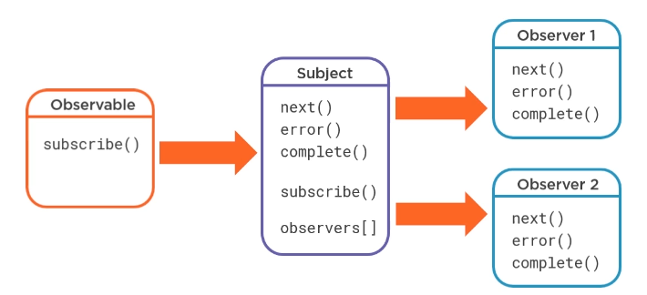

# Subjects

**Subjects** are _both_ **Observers** _and_ **Observers.**

They can **produce their own values**, **proxy values**, have **state** and maintain a list of **other Observers** subscribed to them.

Because they maintain a list of objects that  subscribe to them, Subjects are **multicast** instead of **uni-cast**.

In the following diagram, we see a **Subject** that has subscribed to an **Observable** and also has **two separate** **Observers** subscribed to the **Subject.** When the **Observer** on the left produces values, the **Subject** receives them and then produces them for each Observer subscribing to it.




## Producing Values

A simple version looks like this: using the [**next** ](https://rxjs-dev.firebaseapp.com/api/index/class/Subject#next-)function, the value is passed to **both** subscribers.

```typescript
let subject$ = new Subject();

//* Create the first subscriber
subject$.subscribe(
    value => console.log(`Observer 1: ${value}`)
);

//* Create the second subscriber
subject$.subscribe(
    value => console.log(`Observer 2: ${value}`)
);

//* Produce a value that will be sent to both subs
subject$.next('Hello!');
```

## Acting as a Proxy

To act as a **proxy** as in the diagram above, that is, for the Subject to subscribe to an Observable and _then_ pass the value it receives on to the subjects own subscribers, we would do something like this:

```typescript
let subject$ = new Subject();

//* Create the first subscriber
subject$.subscribe(
    value => console.log(`Observer 1: ${value}`)
);

//* Create the second subscriber
subject$.subscribe(
    value => console.log(`Observer 2: ${value}`)
);

//* Produce a value that will be sent to both subs
subject$.next('Hello!');

//* Create a new Observable
let source$ = new Observable(subscriber => {
    subscriber.next('Greetings!');
});

//* The Subject subscribes to the Observable here, executing it.
//* The value will then be passed on to its own subscribers
//* Created on lines 4 and 9
source$.subscribe(subject$);
```

## Making "Cold" Observables "Hot"

Cold observables have value producers inside themselves and produce values once per execution. Additionally, they are **unicast**. 

There are times when these observables will need to be treated as "hot" observables, able to **multicast** their produced values from external sources.

```typescript
//* Create a Cold Observable
let coldSource$ = interval(1000).pipe(
    take(4)
);

//* Create a Subject that then subscribes to the Cold Observable
let subject$ = new Subject();
coldSource$.subscribe(subject$);

//* These observables then subscribe to the Subject,
//* Allowing coldSource$ to effectively multicast
subject$.subscribe(
    value => console.log(`Observer 1: ${value}`)
);

setTimeout(() => {
    subject$.subscribe(
        value => console.log(`Observer 2: ${value}`)
    );
}, 1000);

setTimeout(() => {
    subject$.subscribe(
        value => console.log(`Observer 2: ${value}`)
    );
}, 2000);


```

### Multicast Operators

RxJS includes **multicast operators** to simplify the process of multicasting the values of cold observables using a **Subject**.

Some of them include:

<table>
  <thead>
    <tr>
      <th style="text-align:left">Name</th>
      <th style="text-align:left">Description</th>
    </tr>
  </thead>
  <tbody>
    <tr>
      <td style="text-align:left"><a href="https://rxjs-dev.firebaseapp.com/api/operators/multicast">multicast()</a>
      </td>
      <td style="text-align:left">
        <ul>
          <li>Takes a Subject as a parameter</li>
          <li>Must call connect() to begin execution</li>
          <li>Returns a <a href="https://rxjs-dev.firebaseapp.com/api/index/class/ConnectableObservable">ConnectableObservable</a>
          </li>
        </ul>
      </td>
    </tr>
    <tr>
      <td style="text-align:left"><a href="https://rxjs-dev.firebaseapp.com/api/operators/refCount">refCount()</a>
      </td>
      <td style="text-align:left">
        <ul>
          <li>Executes when observers &gt; 0</li>
        </ul>
      </td>
    </tr>
    <tr>
      <td style="text-align:left"><a href="https://rxjs-dev.firebaseapp.com/api/operators/publish">publish()</a>
      </td>
      <td style="text-align:left">
        <ul>
          <li>Thin wrapper around multicast()</li>
          <li>Does not require a Subject to be passed</li>
        </ul>
      </td>
    </tr>
    <tr>
      <td style="text-align:left"><a href="https://rxjs-dev.firebaseapp.com/api/operators/share">share()</a>
      </td>
      <td style="text-align:left">
        <ul>
          <li>Executes when observers &gt; 0</li>
          <li>Re-subscribes as necessary</li>
        </ul>
      </td>
    </tr>
  </tbody>
</table>## Specialized Subjects

### [AsyncSubject](https://rxjs-dev.firebaseapp.com/api/index/class/AsyncSubject)

Only emits a value once **complete,** and emits only the **last value received.** This type is used by the [**publishLast\(\)**](https://rxjs-dev.firebaseapp.com/api/operators/publishLast) operator, which:

> Returns a connectable observable sequence that shares a single subscription to the underlying sequence containing only the last notification.

### [BehaviorSubject](https://rxjs-dev.firebaseapp.com/api/index/class/BehaviorSubject)

Will emit an **initial seed value** if the source has **not yet** produced a value. If a subscriber is added **after** **the observer has stopped producing values**, then the **most recent value** will be emitted. Afterwards, if more values are produced, it will receive them along with the rest of the subscribers. Used by the [**publishBehavior\(\)**](https://rxjs-dev.firebaseapp.com/api/operators/publishBehavior) ****operator.

### [ReplaySubject](https://rxjs-dev.firebaseapp.com/api/index/class/ReplaySubject)

> A variant of Subject that "replays" or emits old values to new subscribers. It buffers a set number of values and will emit those values immediately to any new subscribers in addition to emitting new values to existing subscribers.

Used by the [**publishReplay\(\)** ](https://rxjs-dev.firebaseapp.com/api/operators/publishReplay)operator.

### 


